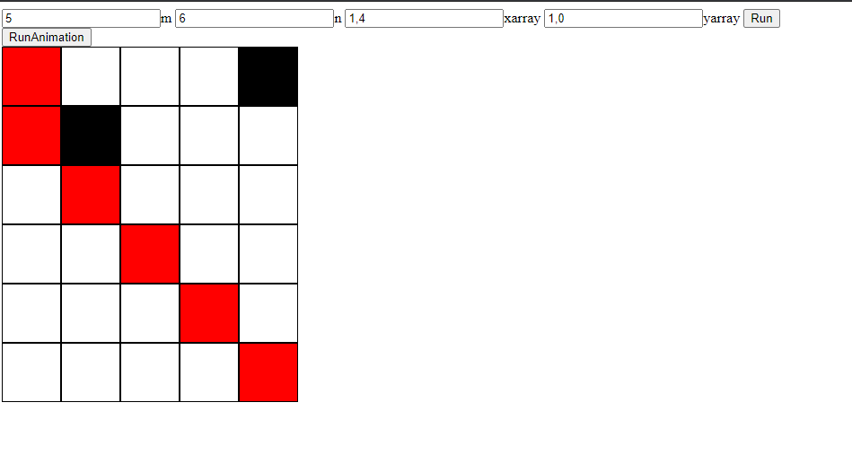
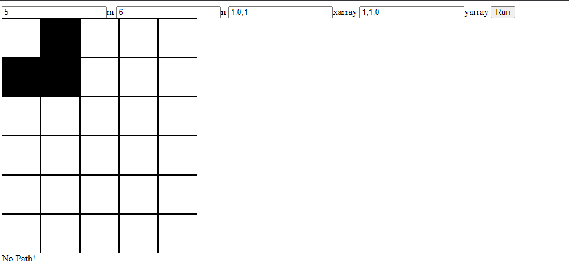

# maze-problem

To run the program, download the code then run index.html.
You should be able to see four input fields in your browser:
1. M: number of columns 
1. N: number of rows
1. Xarray: x coordinates for void cells
1. Yarray: y coordinates for void cells  

Click the run button once the input fields are filled.  
If there is a viable path, you should be able to see the animation that indicate the path of mouse.  
You can also press the RunAnimation button to run animation again.  
If there is no path being found, a text indicating no Path will be shown underneath the table.  

The screenshots are:
1.	Example shown in the pdf. (the input should be m=5, n=6).
  
3.	Situation when there is no path.  

